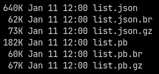

# protobuf 要点

<br><br>
## 特征

1. 最早是为了解决兼容性问题，可以任意增加新字段，这是 google 发明 pb 的原因：如何在大规模的分布式系统中灰度升级，兼顾性能和向下兼容
2. 二进制协议在传输的时候并不是多大优点，其实 json + brotli 压缩后并不比 pb 大很多（[我以前的数据](https://x.com/Soulogic/status/1480754176628240384)）。但序列化/反序列化的开销确实更友好  
   
3. 几乎所有语言都支持 pb，这使得大家对[数据类型](https://protobuf.dev/programming-guides/proto3/#scalar)的定义标准化了（如果是 json 的话，对于 [MAX_SAFE_INTEGER](https://developer.mozilla.org/en-US/docs/Web/JavaScript/Reference/Global_Objects/Number/MAX_SAFE_INTEGER) 2<sup>53</sup>-1 到 2<sup>63</sup>-1 之间的数要怎么办？）
4. 基于 3，在 golang 里如果是解析解构确定的 json，我甚至会专门写 .proto 文件只为了解析 json
5. 描述简单，没什么多余元素，基于 proto 文件做解析也非常容易。可以在这个基础上做很多通用的工具（如[编辑器](https://github.com/fullstorydev/grpcui/blob/master/doc-images/fields.png)、代码生成器等）

尤其是错误代码/枚举值这类，更是擅长

```protobuf
syntax = "proto3";
package pb;

message Error {
	enum Code {
		UNKNOWN = 0;
		OK = 200;
		ACCEPT = 202;
		BAD_REQUEST = 400;
		UNAUTHORIZED = 401;
		FORBIDDEN = 403;
		NOT_FOUND = 404;
		INTERNAL_SERVER_ERROR = 500;
		BAD_GATEWAY = 502;
		SERVICE_UNAVAILABLE = 503;
	}
}
```

<br><br>
## why protobuf

基于以上特征，protobuf 非常适合作为法律，比文档更有效。文档的最大问题是，会出现跟代码不一致的情况，但 protobuf 不一致会直接报错。

> 深渊是下层界使用的语言，也就是魔鬼的语言，堪称塔希里亚最严密的语言，它唯一的特点就是精确，所以现存世上的契约都是用深渊语写的这种语言的特点是非常容易学习，也非常容易看懂，乡巴佬们都这么认为，但是魔鬼总是比你用得要好一点。
>
> ——《塔希里亚故事集》

<br><br>
## 原理

先扯一个远的热热身，如果让我们定义个二进制的 JSON，要怎么写？

数据类型先假定有基本的四种：int32、string、object、array，分别是 0x00、0x01、0x02、0x03

其中 int32 是固定 4 字节，其他三种是先有一位是长度，后面是数据

[建议访问彩色高亮版](https://zhengkai.github.io/protobuf/hex.html)

```
  0  1  2  3  4  5  6  7  8  9  0  1  2  3  4  5  6
+--+--+--+--+--+--+--+--+--+--+--+--+--+--+--+--+--+
 00 00 00 00 01                           // 数字 1（使用 big-endian）
+--+--+--+--+--+--+--+--+--+--+--+--+--+--+--+--+--+
 00 00 00 01 01                         // 数字 257
+--+--+--+--+--+--+--+--+--+--+--+--+--+--+--+--+--+
 01 05 41 42 43 44 45             // 字符串 "ABCDE"
+--+--+--+--+--+--+--+--+--+--+--+--+--+--+--+--+--+
 02 01 01 03 66 6f 6f 00 00 00 00 01
                               // object {"foo": 1}
+--+--+--+--+--+--+--+--+--+--+--+--+--+--+--+--+--+
 03 03 01 01 41 00 00 00 00 01 03 01 02 6b 6b
                          // array ["A", 1, ["bb"]]
```

顺便一题，JSON 作为人类大致可读的数据交换格式，最大的缺憾就在于字符串无可避免地要使用 escape 字符（`\`），这就导致了解析字符串必须每个字节都一个 `if`，是否是 `\`，并且放到一个新变量里，而 msgpack 和 protobuf 都可以直接断言，后面 n 个字节是字符串（除非数据包错误提前中断了），并且直接引用这段内存就可以了，不需要额外逐字节拷贝。

<br><br>
## msgpack

但是这样有点冗长，第一位只有 4 种类型，实际 1 byte 可以有 256 种

那么压缩一下，就是现实中二进制 JSON：[MessagePack](https://msgpack.org/)

他是如何安排 256 种类型的？一份手工调整的 [Type Table](https://github.com/msgpack/msgpack/blob/master/spec.md#formats)，其中包含 128 个正数，32 个负数，32 个字符串，16 个数组/对象，2 个布尔值，其余是不同长度 int/float/str/bin/array/map/ext。不同长度是指，type byte 之后还有几个 byte 来表示长度或者数字本身。

<br><br>
## varint

[官方解释](https://protobuf.dev/programming-guides/encoding/#varints)，变长的思路有点像 UTF-8

每个 byte，先看第一个 bit 是 0 还是 1，如果是 1 就继续读下一位，直到为 0

相比确定位数，0-127 以内都是 1 byte，之后大概律会多一 byte，如果是 4 byte 的整数，varint 要 5 byte

<br><br>
## pb 实现

<br>
<div align="center">
最顶层一定是（以数字为 key 的）map 的 msgpack<br><br>
而这些数字 key 来自于 .proto 的 field number
</div>
<br><br>

如果只有原始数据、没有 .proto 描述，可以用 `protoc --decode_raw < demo.pb` 来大致了解数据，但因为类型丢失，比如 4 byte 数据，你不知道是 `fixed32` 还是 `float`。具体例子文件见本仓库的 `/demo/` 目录

<br><br>
# 使用 tips

永远不要使用 `map`，改为带 key/value 结构的 `repeated`，因为 `map` 保存是乱序的，最终导致相同的值会有不同的 binary

对 pb 支持最差的语言是 lua

<br><br>
## 缺点

`oneof` 里不能直接 `repeated`，需要再包一个结构

`enum` 是全局的，所以不要有顶级 `enum`，一定要放在 `message` 里

```
message EsLogOpenAIFail {
	enum Type {
...

message SummaryDayFailRow {
	EsLogOpenAIFail.Type type = 1;
```

由于以上几个特性，导致 pb 有时略罗嗦

<br><br>
## 性能

正确使用诸如 `int32`、`sint32`、`fixed32`。如果经常有负值，应使用 `sint32`，因为 1 占 1 byte 而 -1 占 5 byte。如果一定是个大数（如秒级时间戳），应使用 `fixed32`，这样只占 4 byte 而不是 5 byte

由于 varint 的性质，数字可以尽量小，但不应该影响设计时方便。有个很特殊的例子，当初做 video slots 的时候，特殊 symbol 是 100 开头，普通 symbol 是 200 开头，我建议两者对调。
